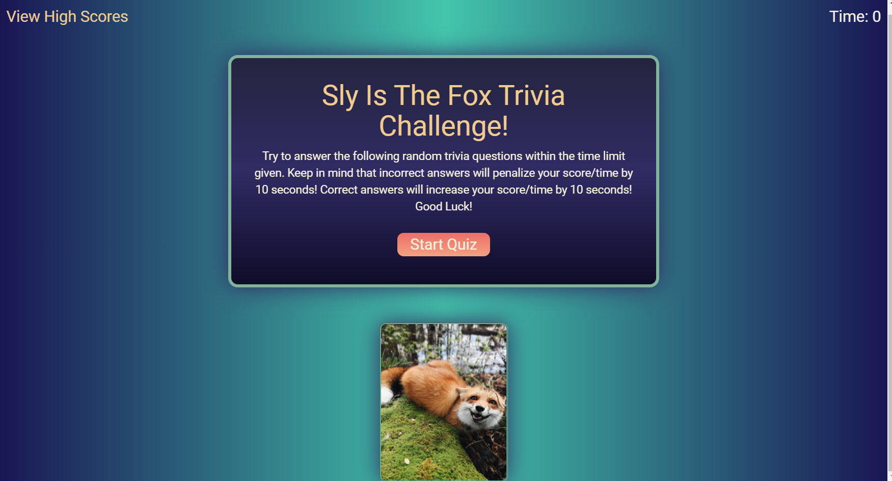
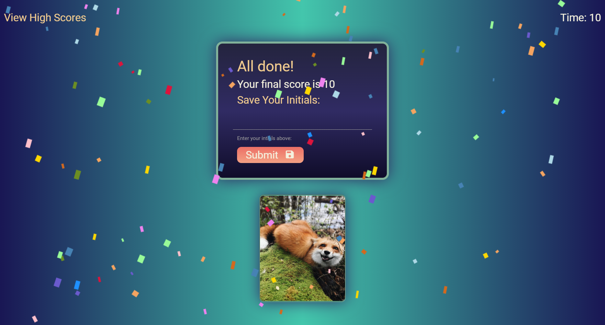
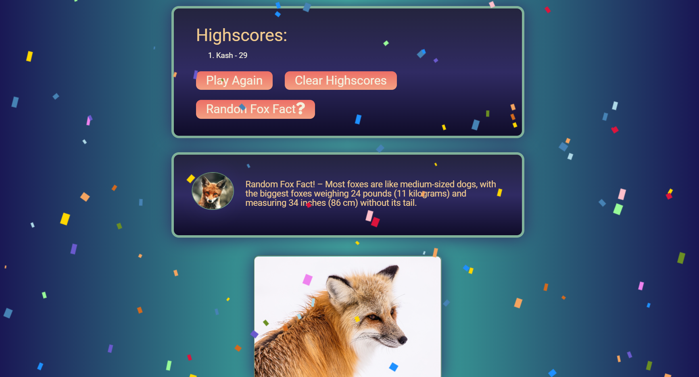

# Sly Is The Fox Trivia Game

### Instructions:

- Trivia game with random questions and fox pictures that are new with each game! 
- Any incorrect answers will penalize score/time by 10 seconds. 
- Correct answers will increase score/time by 10 seconds. 
- If you run out of time, the quiz ends. 
- At the end of the quiz users are praised with falling confetti and have the choice to submit their high score to save in localStorage and then play again. 
- Scores are saved and can be viewed at anypoint by clicking “View High Scores”.
- On the High Score screen users can view random Fox Facts. 
  

---

### Created Using:
- HTML
- Custom CSS
- Materialize CSS Framework
- JavaScript
- Google Font 
- Font Awesome Icons

---

### Web API's Used:
- Random Fox Images for the Site/Favicon
> - https://randomfox.ca/floof/

- Random Trivia Questions with Random Difficulties
> - https://opentdb.com/api_config.php

---

### Github Repository

> https://github.com/Sly-Is-The-Fox/Sly-Is-The-Fox

### Github Live Site

> https://sly-is-the-fox.github.io/Sly-Is-The-Fox/index.html

---

